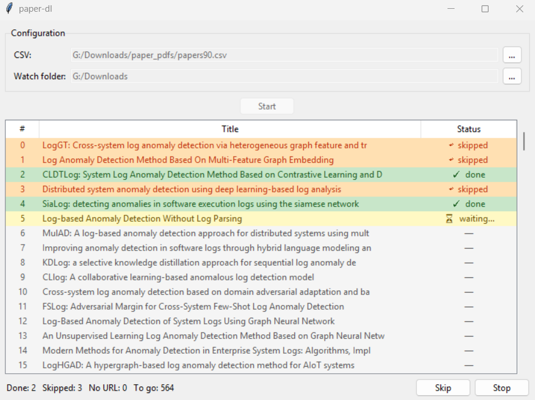

# paper-dl



Works through a list of papers one by one, opens each in the browser, waits for a PDF to land in your downloads folder, logs it, and moves on. You still click "Download PDF" on the publisher page. paper-dl handles the queue and keeps track of what's been done.

## Getting started

Requires Python 3.9+ and pandas (`pip install pandas`).

```
python paper_dl_gui.py
```

Set your CSV and watch folder in the app, hit **Start**. That's it.

## Input: Scopus export

Export your search results from Scopus as CSV (`Export > CSV`, select all fields) and point paper-dl at that file directly, no cleanup needed. The `DOI`, `Title`, and `Link` columns are picked up automatically.

Any CSV works as long as it has a `DOI` and/or `Link` column (case-insensitive, so lowercase variants like `doi` and `link` are fine too).

## History file

Every run appends to a `<csv_name>_history.csv` file placed next to your input CSV. This serves two purposes:

**Resuming.** You can stop at any point and pick up exactly where you left off. Papers whose PDFs are confirmed present in the watch folder are skipped automatically. Papers you pressed Skip on will be retried, so you get another shot at them.

**Later analysis.** The history file records each paper's row index, title, downloaded filename, and timestamp. You can join it back to your original Scopus export for bibliometric work, coverage checks, or tracking what you actually retrieved vs. what was behind a paywall.

| Column | Description |
|--------|-------------|
| `row` | Row index in the source CSV |
| `title` | Paper title |
| `file` | Downloaded filename, `SKIPPED_USER`, or `SKIPPED_NO_URL` |
| `time` | Timestamp |

## GUI controls

| Button | Action |
|--------|--------|
| **Start** | Load the CSV, lock the paths, begin the queue |
| **Skip** | Skip the current paper and move to the next |
| **Stop** | Halt the queue and return to the start screen |

The paper list updates live with colour coding: green = done, yellow = waiting, orange = skipped, grey = no URL.

## CLI

A headless version is available if you prefer the terminal:

```bash
python paper_dl.py <csv_file> <watch_folder>
```

`Ctrl+C` during a wait prompts to skip, stop, or retry the current paper.
